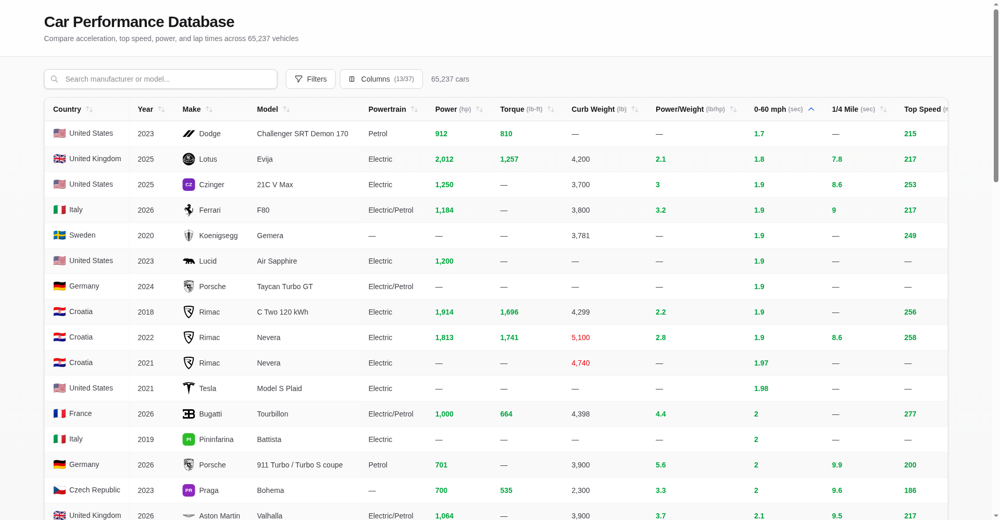

<p align="center">
  
</p>

# Car Performance Database

<!-- BADGES:START -->


[](LICENSE.md)
[](CONTRIBUTING.md)
<!-- BADGES:END -->

## Table of Contents

- [Description](#description)
- [Screenshots](#screenshots)
- [Features](#features)
- [Requirements](#requirements)
- [Installation](#installation)
- [Usage](#usage)
  - [Browsing the data](#browsing-the-data)
  - [Rebuilding the database](#rebuilding-the-database)
  - [Adding a data source](#adding-a-data-source)
- [Data Sources](#data-sources)
- [API Reference](#api-reference)
- [Architecture](#architecture)
- [Credits](#credits)
- [Contributing](#contributing)
- [License](#license)

## Description

A web app for comparing car performance figures across **65,390 vehicles** from
357 manufacturers: 0–60 mph and quarter-mile times, top speed, power, torque,
weight, braking, skidpad grip and lap times at the Nürburgring, the Top Gear test
track and Virginia International Raceway.

The figures are gathered from magazine road tests, Wikipedia record tables,
official EPA data and community data sets by a Python ETL pipeline, merged into
one SQLite database, and served by a Next.js app that searches, filters and sorts
them on the server. Every record keeps a list of the sources it came from.

## Screenshots

<p align="center">
  
</p>

<p align="center"><em>The table sorted by 0–60 mph, with a few spec columns hidden. Green marks a figure in the best 10% for its column, red one in the worst 10%.</em></p>

## Features

- **65,390 vehicles** with a manufacturer, model and year, and 37 columns of
  specifications and test results
- **Server-side search, sorting and pagination** over SQLite, so the browser
  never loads the whole data set
- **Filters** by manufacturer, country, year range, data source, body style,
  powertrain, engine type, aspiration, engine placement and drivetrain
- **Threshold filters** such as minimum power, maximum curb weight, maximum
  0–60 time and minimum top speed
- **Percentile highlighting**: each figure in the best or worst 10% of its
  column is coloured green or red
- **Column picker** to show any of the 37 columns
- **Manufacturer logos, country flags and body-style icons**
- **Source tracking**: every row lists the publications its figures came from
- **Light and dark themes** that follow your system setting
- **A Python ETL pipeline** with per-source parsers, validation, merging and a
  data-quality report, which also generates the app's TypeScript types

## Requirements

- **Node.js 20.9** or newer (required by Next.js 16) and npm
- To rebuild the database: **Python 3.11** or newer with `pyyaml`
  (`etl/requirements.txt`), plus `beautifulsoup4` for the Wikipedia HTML helper
  script, **and the source files** described under
  [Rebuilding the database](#rebuilding-the-database)

The finished database, `public/data/car-performance-data.db`, is included, so
the app runs without Python.

## Installation

```bash
git clone https://github.com/geoffmyers/car-performance-comparison.git
cd car-performance-comparison
npm install
npm run dev
```

Open [http://localhost:3000](http://localhost:3000).

For a production build:

```bash
npm run build
npm start
```

The app reads the database from disk at request time, so it needs a Node.js
server; it cannot be exported as static files.

## Usage

### Browsing the data

- **Search** by manufacturer or model in the search box.
- **Sort** by clicking any column header. The table opens sorted by 0–60 mph,
  fastest first.
- **Filter** with the **Filters** button: categories such as body style and
  drivetrain, a year range, and thresholds such as "at least 500 hp".
- **Choose columns** with the **Columns** button. The table shows 19 of the 37
  by default.
- **Page** through results 50 at a time, or change the page size.

### Rebuilding the database

The pipeline reads raw source files from `public/data/<source>/` and writes the
database, a CSV copy and `src/types/car.ts`. **Those source files are not in
this repository**: they are other publishers' pages and data sets, kept only as
input. To rebuild, collect the files listed in `etl/config/sources.yaml` into
the paths it names, then run from the project root:

```bash
pip install -r etl/requirements.txt

python -m etl.cli list-sources                  # what is configured
python -m etl.cli run                           # every enabled source
python -m etl.cli run --sources wikipedia_top_gear --dry-run
python -m etl.cli run --output-format sqlite    # skip the CSV
python -m etl.cli validate                      # check the data
python -m etl.cli report                        # data-quality report
python -m etl.cli generate-types                # regenerate src/types/car.ts
python -m etl.cli schema                        # print the field definitions
```

Add `-v` for verbose output.

### Adding a data source

1. Write a parser in `etl/parsers/<source>/` that subclasses `BaseParser` from
   `etl/parsers/base.py`.
2. Describe the source in `etl/config/sources.yaml`: its path, parser, priority
   and field mappings.
3. Register the parser in `etl/parsers/registry.py`.
4. Run `python -m etl.cli run --sources <your_source>`.

Field definitions live in `etl/config/schema.yaml`, not in code.

## Data Sources

Configured in `etl/config/sources.yaml`, where each source also carries the
priority used to settle conflicts when two sources disagree.

| Source | What it provides |
|---|---|
| Car and Driver review specs | Instrumented tests: 0–60, quarter mile, braking, skidpad |
| Car and Driver Lightning Lap | Lap times at Virginia International Raceway |
| Wikipedia: Nürburgring Nordschleife lap times | Lap times, dates and drivers |
| Wikipedia: Top Gear test track lap times | Power Lap times and episodes |
| Wikipedia: acceleration, speed and power-output records | Record figures |
| EPA fuel economy data | Official specifications |
| Kaggle car specifications | Community-contributed specifications |
| Autoevolution | Vehicle specifications |
| MotorTrend figure-eight | Configured but **disabled** |

## API Reference

### `GET /api/cars`

A page of cars, filtered and sorted.

| Parameter | Type | Default | Description |
|---|---|---|---|
| `page` | number | `1` | Page number |
| `pageSize` | number | `50` | Rows per page, at most 100 |
| `sortBy` | string | | Column to sort by |
| `sortOrder` | `asc` \| `desc` | `asc` | Sort direction |
| `search` | string | | Matches manufacturer and model |
| `manufacturer`, `country`, `source` | string | | Exact matches; `country` is a code such as `US`, and `source` matches any one of a row's sources |
| `yearMin`, `yearMax` | number | | Year range |
| `bodyStyle`, `propulsion`, `engineType`, `engineAspiration`, `enginePlacement`, `drivetrain` | string | | Category filters |
| `displacementMin`, `powerMin`, `torqueMin`, `topSpeedMin` | number | | Lower bounds |
| `weightMax`, `powerToWeightMax`, `accel060Max`, `quarterMileMax` | number | | Upper bounds |

```json
{
  "data": [{ "manufacturer": "Lotus", "model": "Evija", "year": "2025", "0_60_mph_sec": 1.8, "...": "..." }],
  "pagination": { "page": 1, "pageSize": 50, "totalCount": 65390, "totalPages": 1308 }
}
```

### `GET /api/cars/meta`

The options for every filter, with counts: `manufacturers`, `countries`,
`sources`, `bodyStyles`, `propulsions`, `engineTypes`, `engineAspirations`,
`enginePlacements`, `drivetrains`, the threshold choices, `yearRange` and
`totalCount`.

### `GET /api/cars/percentiles`

The 10th and 90th percentile of each numeric column, which the table uses for
its green and red highlighting.

## Architecture

```
public/data/<source>/  ──►  etl/ (Python)  ──►  public/data/car-performance-data.db
                            parse, validate,          │
                            merge, report             ▼
                                                src/lib/db.ts (better-sqlite3)
                                                      │
                                                src/app/api/cars/*  (Zod-validated)
                                                      │
                                                src/components/DataTable.tsx (TanStack Table)
```

| Path | Role |
|---|---|
| `src/app/page.tsx` | The single page |
| `src/app/api/cars/` | `route.ts`, `meta/` and `percentiles/` |
| `src/lib/db.ts` | Query building; only rows with a manufacturer, model and year are served |
| `src/lib/schemas.ts` | Zod schemas for the API parameters |
| `src/hooks/useCarsApi.ts` | Data fetching and the percentile colouring rules |
| `src/components/` | `DataTable`, `ServerFilterPanel`, `ColumnVisibilityPanel`, `Pagination`, `ManufacturerLogo`, `CountryFlag`, `BodyStyleIcon` |
| `src/types/car.ts` | Generated by the ETL from `etl/config/schema.yaml` |
| `etl/` | `cli.py`, `config/`, `core/` (conversion, enrichment, manufacturer names, merging), `parsers/`, `validators/`, `outputs/` (CSV, SQLite, TypeScript, quality report) |
| `scripts/` | Standalone update scripts and a Wikipedia HTML parser |
| `public/logos/`, `public/images/` | Manufacturer logos and body-style images |

See [ARCHITECTURE.md](ARCHITECTURE.md) for more detail.

## Credits

- Built with [Next.js](https://nextjs.org/), [React](https://react.dev/),
  [TanStack Table](https://tanstack.com/table),
  [Tailwind CSS](https://tailwindcss.com/), [Zod](https://zod.dev/),
  [better-sqlite3](https://github.com/WiseLibs/better-sqlite3) and
  [PapaParse](https://www.papaparse.com/); the ETL uses
  [PyYAML](https://pyyaml.org/) and
  [Beautiful Soup](https://www.crummy.com/software/BeautifulSoup/).
- Figures are compiled from [Car and Driver](https://www.caranddriver.com/),
  [Wikipedia](https://www.wikipedia.org/) (CC BY-SA),
  [fueleconomy.gov](https://www.fueleconomy.gov/) (US EPA),
  [Kaggle](https://www.kaggle.com/) and
  [autoevolution](https://www.autoevolution.com/). Each record lists its
  sources.
- Manufacturer logos come from [Simple Icons](https://simpleicons.org/) and
  [Wikimedia Commons](https://commons.wikimedia.org/). Car makes, logos and
  publication names are trademarks of their respective owners, and this project
  is not affiliated with any of them.
- The README icon is the [Font Awesome](https://fontawesome.com/) `gauge-high` glyph,
  used under [CC BY 4.0](https://creativecommons.org/licenses/by/4.0/).

Written by Geoff Myers.

## Contributing

Bug reports and pull requests are welcome. See [CONTRIBUTING.md](CONTRIBUTING.md)
for setup, checks and how this repository is published.

## License

This program is free software: you can redistribute it and/or modify it under
the terms of the GNU General Public License as published by the Free Software
Foundation, either version 3 of the License, or (at your option) any later
version.

This program is distributed in the hope that it will be useful, but WITHOUT ANY
WARRANTY; without even the implied warranty of MERCHANTABILITY or FITNESS FOR A
PARTICULAR PURPOSE. See [LICENSE.md](LICENSE.md) for the full text of the GNU
General Public License.

SPDX-License-Identifier: `GPL-3.0-or-later`
